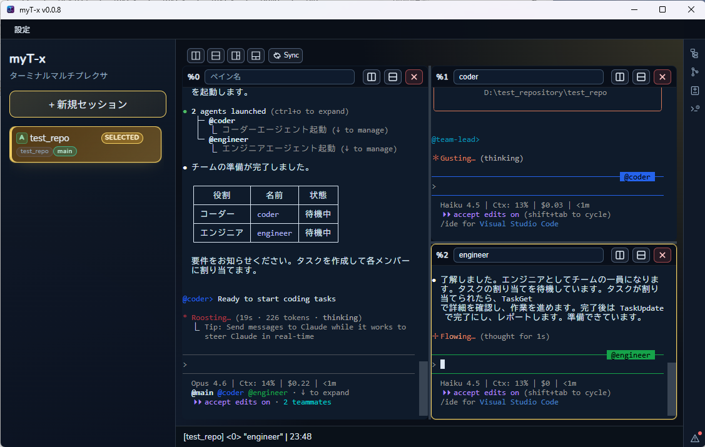

# myT-x

## 概要




**WindowでもネイティブにClaude Codeチーム開発を楽しみたい！**  
**いい感じのGUIが欲しい。難しいのやだ！！視覚的にわかりやすいのが欲しい**　　
**あれもこれもやりたい。**　　
**トークン量が足りないので何とかいい感じにしたい。**  　　

という、思いから作成しました。　　
このアプリケーションはmyT-x.exe一つで、上記を実現します。
プログラムの整理ができ次第、ソース事公開予定。

- 開発者
  - claude code,codex cli
- 査読・評価者
  - gemini cli
- メインレビュアー  
  - copilot(opus)

そもそも、私による私の為のアプリケーションである事が前提となる為　　
OSS、セキュリティ診断を継続的に行い　　
安心安全に利用できるように、リファクタリングをAIが随時遂行しております。　　　
基本的な機能に関する破壊的変更は予定しておりませんが　　
内部的には破壊的リファクタリングが発生していますので　　
破壊された機能に対する修正は発見し次第となります。
　　
リファクタリングや機能開発を先行している関係で、フォルダ整理が済んでいない影響で　　
ソースコードの公開を後回しにしております。

## 大事なこと

一つこれだけはお伝えしますが　　
**ターミナル操作系のアプリケーションには最大限注意してください**　　
特に、今回の仕組みを開発して思ったのが、悪意を忍び込ませることが可能すぎます。　　
私が言うのもなんですが、有名なOSSや、有名なエディタ以外は　　
怖さしかないです。　　

なので作ったし作ってよかったと思います。　　


---

## はじめかた

`myT-x.exe` をダブルクリックで起動するだけです。
初回は設定ファイルが自動で作られるので、すぐ使いはじめられます。

---

## Agent Teams のモデルを自動で切り替える

Claude Code の Agent Teams では、親エージェントが子エージェントを次々と起動します。
myT-x はこの起動時に、子エージェントのモデルを自動で置き換えることができます。

設定画面の「**Agent Model**」タブを開くと、次の2つの仕組みが用意されています。

### 一括置換（すべての子エージェントに適用）

「**置換元**」と「**置換先**」にモデル名を入れると、子エージェントが起動されるたびにモデルが自動で差し替わります。

```
設定画面での入力:

  置換元 (from):  claude-opus-4-6
  置換先 (to):    claude-sonnet-4-5-20250929
```

こうすると、すべての子エージェントが Opus ではなく Sonnet で動きます。
コストを抑えたいときに便利です。

### エージェント名ごとの個別設定（オーバーライド）

「ここだけは高性能モデルを使いたい」というエージェントがいる場合、オーバーライドを追加します。

```
設定画面での入力:

  #1  エージェント名: security     モデル: claude-opus-4-6
  #2  エージェント名: reviewer     モデル: claude-sonnet-4-5-20250929
  #3  エージェント名: coder        モデル: claude-sonnet-4-5-20250929
```

エージェント名は部分一致で判定されます（大文字小文字は区別しません）。
上から順に評価され、最初にマッチしたルールが使われます。

**使い分けの例:**

| やりたいこと | 設定方法 |
|------------|---------|
| 全体的にコストを下げたい | 置換元を Opus、置換先を Sonnet に |
| セキュリティだけは慎重に | オーバーライドで `security` に Opus を指定 |
| 用途ごとに最適なモデルを | オーバーライドを複数追加して使い分け |

---

## 思考レベルを一括設定する

設定画面の「**環境変数**」タブには、思考レベルの専用セレクタがあります。

```
設定画面での入力:

  思考Level (CLAUDE_CODE_EFFORT_LEVEL):  [low / medium / high]
```

ここで選んだ値が、すべてのペインに自動で設定されます。
ペインを開くたびに手で `export` する必要はありません。

| 思考レベル | 特徴 |
|----------|------|
| **high** | じっくり考える。複雑なタスクや重要な判断に |
| **medium** | バランス型。通常の作業に |
| **low** | 素早く返答。単純な作業やチャットに |

### その他の環境変数

同じ画面で、好きな環境変数を追加することもできます。
「**+ 環境変数追加**」ボタンから変数名と値を入れるだけです。
すべてのペインに自動で反映されます。

---

## Agent Team セッションの作り方

サイドバーの「**+ 新規セッション**」から、フォルダを選んでセッションを作ります。
「**Agent Team として開始**」にチェックを入れると、そのセッションは Agent Teams 用になります。

サイドバーでは通常セッションが `S`、Agent Team セッションが `A` のマークで区別されます。

---

## 画面の見かた

```
+------------------------------------------------------------+
|  [設定]                                                     |
+------------+-----------------------------------------------+
|            |  ┌──────────────┬──────────────┐              |
|  myT-x     |  │              │              │              |
|            |  │  ペイン 1     │  ペイン 2    │              |
| ────────── |  │              │              │              |
|            |  │  PowerShell   │  PowerShell  │              |
| S 作業A    |  │              │              │              |
| S 作業B    |  └──────────────┴──────────────┘              |
| A Agent    |                                               |
|            |                                               |
| [+ 新規]   |                                               |
+------------+-----------------------------------------------+
|  作業A | ペイン: 2 | 13:42          [SYNC] [プレフィックス]   |
+------------------------------------------------------------+
```

**左のサイドバー** - セッション一覧。クリックで切替、ドラッグで並び替え、ダブルクリックで名前変更。

**右のメインエリア** - ターミナル画面。分割して自由に並べられます。

**下のステータスバー** - 現在のセッション名や状態が表示されます。

---

## ターミナルの便利な使い方

### 画面分割

ペインのツールバーにあるアイコンで左右・上下に分割できます。
ペインが増えたら、レイアウトボタン（横均等・縦均等・左メイン・上メイン・タイル）で一発整列。

### すぐ呼び出し（Quake Mode）

`Ctrl+Shift+F12` でウィンドウが出たり隠れたりします。
ブラウザやエディタで作業中でも、ターミナルが必要なときだけパッと呼び出せます。

### クイック検索

`Ctrl+P` でセッション名・ブランチ名をあいまい検索。たくさんセッションがあっても一瞬で見つかります。

### コピー＆ペースト

テキストを選択すると自動コピー。右クリックでペースト。`Ctrl+C` / `Ctrl+V` も直感的に動きます。

### 文字サイズ変更

`Ctrl` + マウスホイールで拡大・縮小。

### ファイルドロップ

ファイルをペインにドロップするとパスが入力されます。

### テキスト検索

`Ctrl+F` でペイン内の出力をテキスト検索。長いログからエラーを探すのに便利です。

---

## 設定でカスタマイズ

画面左上の「**設定**」ボタンから、5つのタブで設定を変えられます。

### 基本設定

| 変えられること | どうなるか |
|--------------|----------|
| Shell | ペインで起動するシェルが変わります（PowerShell / pwsh / cmd / bash / WSL） |
| Prefix | ショートカットの起動キーが変わります（初期値: `Ctrl+b`） |
| Quake Mode | ON にするとホットキーでウィンドウを呼び出せます |
| Global Hotkey | Quake Mode のキーを変えられます（初期値: `Ctrl+Shift+F12`） |

### キーバインド

Prefix キーのあとに押すキーを好みに変えられます。

| 操作 | 初期値 |
|------|--------|
| 左右分割 | `%` |
| 上下分割 | `"` |
| ズーム切替 | `z` |
| ペインを閉じる | `x` |
| デタッチ | `d` |

### Agent Model / 環境変数

上の「Agent Teams のモデルを自動で切り替える」「思考レベルを一括設定する」を参照してください。

### Worktree（Git 連携）

Git リポジトリでセッションを作ると、Worktree 機能が使えます。
ブランチごとに独立した作業フォルダが自動で作られ、片付けまで面倒を見てくれます。

| 変えられること | どうなるか |
|--------------|----------|
| 有効/無効 | OFF にすると Worktree 関連の操作が非表示に |
| 強制削除 | ON にすると未コミット変更があっても Worktree を削除できます |
| セットアップスクリプト | 作成後に `npm install` などを自動実行 |
| コピーファイル | `.env` など git 管理外のファイルを自動コピー |

サイドバーではリポジトリ名とブランチ名がバッジで表示され、`main → feature/xxx` のように関係がひと目でわかります。

---

## ショートカット一覧

| キー | 動作 |
|------|------|
| `Ctrl+b` → `%` | 左右に分割 |
| `Ctrl+b` → `"` | 上下に分割 |
| `Ctrl+b` → `z` | ズーム（最大化 / 戻す） |
| `Ctrl+b` → `x` | ペインを閉じる |
| `Ctrl+b` → `d` | デタッチ |
| `Ctrl+P` | クイック検索 |
| `Ctrl+F` | テキスト検索 |
| `Ctrl+C` | 選択中ならコピー / なければ処理中断 |
| `Ctrl+V` | ペースト |
| `Ctrl+ホイール` | 文字サイズ変更 |
| `Ctrl+Shift+F12` | ウィンドウの呼び出し / 非表示 |

---

## 困ったとき

**設定がおかしくなった** → 設定ファイルに問題があってもアプリは起動します。設定画面から直してください。

**ホットキーが効かない** → 他のアプリが同じキーを使っていないか確認してください。設定画面で別のキーに変えられます。

**ペイン分割できない** → まず `Ctrl+b` を押して、ステータスバーに「プレフィックス」と出てから次のキーを押してください。

---

## 動作環境

Windows 10 / 11 で動作します。
