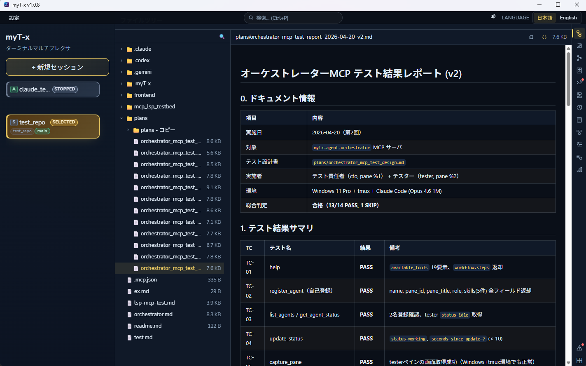

# myT-x

**Windows民によるWindows民の私による私の為のターミナル**

- [日本語版詳細](./README.md)
- [英語版詳細](./README_EN.md)

## 前置き
本プログラムの利用によって生じたあらゆる損害について、制作者は一切の責任を負いません。
ペイン連携等の関係により、管理者権限での実行が必要です。

**機能追加要望随時募集中**

---

## 概要

**Claude Codeエージェントチーム**

**File View Mode**
md,openAPI(swagger),drawio...
  
  
**Editor**

**ダッシュボード**

**よくある指示簡易登録機能**

**オーケストレーターMCP&キャンバスモード＆タイムライン**


**WindowでもネイティブにClaude Codeチーム開発を楽しみたい！**  <br>
**いい感じのGUIが欲しい。難しいのやだ！！視覚的にわかりやすいのが欲しい**　　<br>
**あれもこれもやりたい。**　　<br>
**トークン量が足りないので何とかいい感じにしたい。**  　　<br>

---

## 主な機能

| 機能 | 説明 |
|------|------|
| ターミナル分割 | ペインの左右・上下分割、5種のレイアウトプリセット |
| AutoStart（自動起動） | ペインツールバーから新規ペインへコマンドを即時起動（最大 50 件登録） |
| Agent Teams | Claude Code / Codex CLI / Gemini CLI のチーム連携 |
| モデル自動切替 | 子エージェントのモデルを一括/個別に自動置換 |
| Git Worktree | ブランチごとの独立作業フォルダ管理（セットアップスクリプト + 進捗表示対応） |
| ファイルビュー (File View) | Markdown / Mermaid / Swagger(OpenAPI) / draw.io / SQLite / Markmap / Vega / Vega-Lite / WaveDrom の統合プレビュー（`Ctrl+Shift+E`） |
| SQLite Viewer | `.db` / `.sqlite` / `.sqlite3` のテーブル一覧 + 行データ表示 + CSV エクスポート（読み取り専用） |
| Prompt Presets | 固定プロンプトテンプレートを登録してチャット入力に追記（グローバル / プロジェクトの 2 スコープ、最大 200 件、`Ctrl+Shift+P`） |
| Usage Dashboard | Claude Code / Codex の利用統計を可視化（比較モード + ソース選択、エージェント / スキル / スラッシュコマンドの集計、日次棒グラフ、30 日間日次アクティビティ、`Ctrl+Shift+U`） |
| Session Memo | セッション単位のメモを右サイドバーで編集し、`.myT-x/session-memo.md` に保存（`Ctrl+Shift+N`） |
| 14種のビューア | Editor / File View / Git Graph / Diff / Input History / MCP Manager / スケジューラ / タスクキュー / Single Task Runner / チーム管理 / Usage Dashboard / Session Memo / Prompt Presets / Error Log |
| MCP内蔵 | オーケストレーションMCP + Single Task Runner MCP + LSP-MCP 200種以上 |
| タスク自動化 | ペインスケジューラ（定期実行）+ タスクスケジューラ（順次実行）+ Single Task Runner（軽量版、`Ctrl+Shift+J`） |
| ペインチャットバー | 各ペイン下部にチャット入力バーを常時ドッキング、クリックで対象ペインへ送信 |
| コマンドパレット | `Ctrl+P` でセッション切替・ビューアー起動・コマンド実行（MenuBarトリガーボタン対応） |
| キャンバスモード | エージェント間のタスクフローを視覚化（ルートペイン手動指定対応） |
| ターミナル検索 | インクリメンタル検索・検索結果カウンタ・一致箇所ハイライト表示（`Ctrl+F`） |
| Quake Mode | ホットキーでウィンドウ即呼び出し |
| Diff インラインコメント | Diff行ホバーで `+` ボタン → インラインtextarea展開 → Markdown形式でAIペインに一括送信（`Ctrl+Shift+D`） |
| Markdown アウトライン | MarkdownPreviewに折りたたみ可能なアウトラインパネル（見出し一覧 + ページ内ジャンプ） |
| 日本語IME対応 | WebView2プロセス分離 + IMEリセット機能 + ターミナルフォーカス復帰時の自動復旧 |

---

## はじめかた

`myT-x.exe` をダブルクリックで起動するだけです。<br>
初回は設定ファイルが自動で作られるので、すぐ使いはじめられます。<br>

https://github.com/my-take-dev/myT-x/releases

---

## ドキュメント

詳しい使い方は `doc/` フォルダのマニュアルをご覧ください。

| ドキュメント | 内容 |
|------------|------|
| [はじめかた](doc/getting-started.md) | インストール、最初のセッション作成 |
| [画面の見かた](doc/screen-layout.md) | メニューバー、サイドバー、メインエリア、Activity Strip の各UI要素 |
| [ターミナル操作](doc/terminal-operations.md) | 分割、コピペ、検索、Quake Mode、同期入力、チャット入力バー |
| [ビューアシステム](doc/viewer-system.md) | 14種のビューア（Editor / File View / Git Graph / Diff / Usage Dashboard / Session Memo / Prompt Presets 等）の詳細操作 |
| [設定](doc/settings.md) | 7つの設定タブ（基本設定 / AutoStart / キーバインド / Worktree / Agent Model / 環境変数） |
| [Agent Teams](doc/agent-teams.md) | チーム作成、メンバー管理、オーケストレーションMCP、キャンバスモード |
| [タスクスケジューラ](doc/task-scheduler.md) | ペインスケジューラとタスクスケジューラの使い方 |
| [ショートカット一覧](doc/shortcuts.md) | 全キーボードショートカット |
| [トラブルシューティング](doc/troubleshooting.md) | よくある問題と対処法 |

---

## 本アプリケーションについて

私が社用で利用する事を想定している為　　<br>
OSS、セキュリティ診断を継続的に行い　　<br>
安心安全に利用できるように、リファクタリングをAIが随時遂行しております。　　　<br>
基本的な機能に関する破壊的変更は予定しておりませんが　　<br>
内部的には破壊的リファクタリングが随時発生していますので　　<br>
破壊された機能に対する修正は発見し次第となります。<br>

Claude code マルチエージェント機能、オーケストレーターMCPに関しては<br>
検証の自動化を実施して毎度担保できるようにしております。


---

## 動作確認方法

※ makefileを使って運用しています。
```sh
# デバッグモード
make dev

# 本番ビルド
make build
```

---

## 動作環境

Windows 10 / 11
